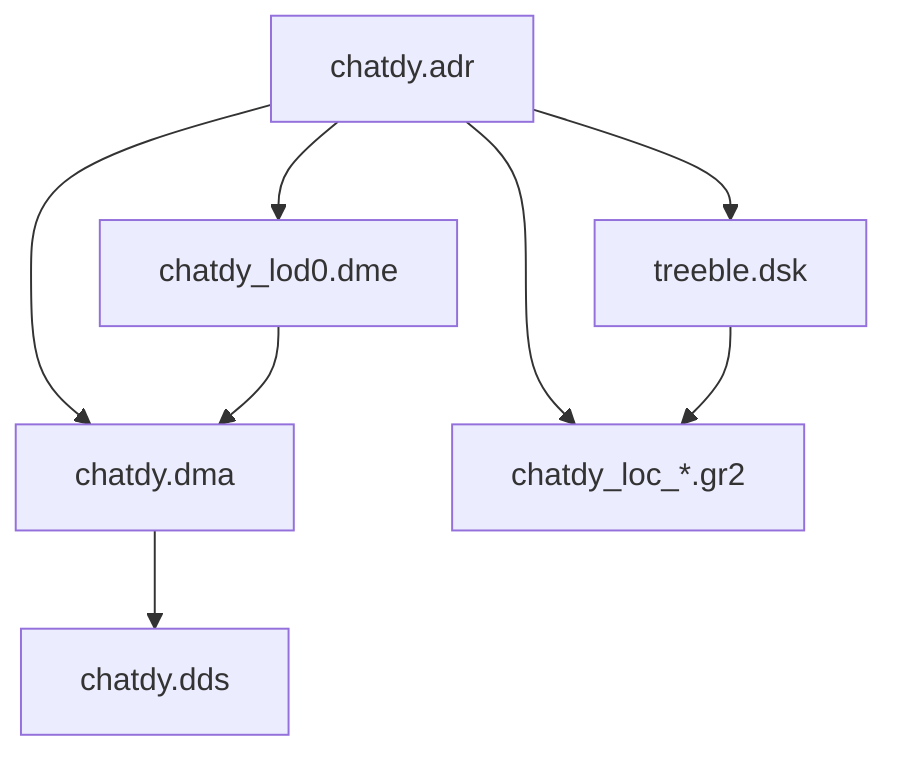

# Free Realms / ForgeLight 3D Asset Format Notes

Reverse-engineered from the **chatdy** fox NPC sample (`chatdy.adr`, `treeble.dsk`, `chatdy_lod0.dme`, `chatdy.dma`, `chatdy_loc_walk.gr2`) and cross-referenced with:

- `Client/materials_3.xml` (vertex input layouts)
- `Client/Resources/AnimationTypes.xml` (animation slot names)
- `Client/Resources/Models.txt` (actor registration)
- [ForgeLightToolkit](https://github.com/EDITzDev/ForgeLightToolkit) Unity importers (partial DME/DMA/ADR support)

## Asset pipeline overview

A playable animated NPC is not a single file. Free Realms stitches together:

| Extension | Magic | Role |
|-----------|-------|------|
| `.adr` | none | Actor definition: skeleton, mesh, material, animation slots, sockets, foley metadata |
| `.dsk` | `DSKE` | Skeleton: bone names, hierarchy blob, bind-pose 4×4 matrices |
| `.dme` | `DMOD` | Skinned mesh geometry + embedded material block |
| `.dma` | `DMAT` | Material/texture references and shader parameter blocks |
| `.gr2` | Granny3D | Skeletal animation curves (RAD Game Tools format) |
| `.dds` | DirectDraw Surface | Diffuse/normal/etc. textures referenced by `.dma` |
| `.agr` | XML | Composite actor sets (equipment/costume layering), not the base rig |

Shipped game assets are zlib-compressed as `.z` entries in the packed archive (`Assets_manifest.txt`).



## `.adr` — Actor Definition Resource

Top-level file is a sequence of typed blocks:

```
u8 section_type
compressed_length section_size
u8 section_size bytes payload
```

### Known section types (chatdy)

| Type | Purpose |
|------|---------|
| `1` | Skeleton reference (`treeble.dsk`) |
| `2` | Model block: mesh `.dme`, material `.dma`, optional scale (`f32`) |
| `9` | Locomotion/combat/emote animation bank → `.gr2` files |
| `10` | Foley/audio metadata keyed by animation slot name |
| `19` | Attachment sockets (Head, Neck, Pelvis, hands, etc.) |

### Nested record format (inside sections)

```
u8 record_type
compressed_length payload_size
payload
```

Animation entries in type `9` use:

| Sub-type | Content |
|----------|---------|
| `1` | Animation slot name (`loc_walk`, `emo_dance_basic`, …) |
| `2` | `.gr2` filename |
| `4` | `f32` playback scalar (big-endian in observed chatdy files) |

Slot names must match entries in `Client/Resources/AnimationTypes.xml` (e.g. `loc_stand`, `loc_walk`, `loc_run`).

## `.dsk` — Skeleton (`DSKE`)

```
char[4] magic = "DSKE"
u32 version            // 2 for chatdy/treeble
u32 bone_name_bytes
... null-terminated bone names ...
... hierarchy blob ... // partially understood tree encoding
... bone_count × 48-byte bind pose transforms (3×4 `f32` rows, row-major) ...
```

Chatdy reuses **`treeble.dsk`** — a 92-bone quadruped rig (`ROOT`, `PELVIS`, `SPINEUPPER`, `HEAD`, wing helper bones, tail chain, facial bones, etc.).

Custom creatures can either:

1. Reuse an existing `.dsk` and match bone names in your DCC export, or
2. Author a new skeleton and update all dependent `.gr2` / skin weights accordingly.

## `.dma` / embedded DMAT in `.dme`

```
char[4] magic = "DMAT"
u32 version = 1
u32 texture_block_size
... null-terminated texture filenames ...
u32 material_count
repeat material_count:
    u32 material_name_hash
    u32 parameter_block_size
    ... shader parameters ...
```

Material hash selects a vertex input layout from `materials_3.xml`.

## `.dme` — Mesh (`DMOD`)

```
char[4] magic = "DMOD"
u32 version            // 3 for chatdy
u32 dma_size
... DMAT blob ...
float3 bounds_min
float3 bounds_max
u32 mesh_count         // version >= 3
repeat mesh_count:
    i32 material_index
    i32 unknown × 3    // chatdy uses (7, 24, -1) for 7 render batches; new meshes use (1, 24, -1)
    i32 vertex_stride  // 52 = ClrNrmUVSkin
    i32 vertex_count
    i32 index_stride   // 2 or 4
    i32 index_count
    vertex_count × vertex_stride bytes
    index_count × index_stride bytes
... trailing render-batch metadata (required for skinned meshes) ...
```

**Important:** The trailing section is **not optional** for skinned NPC meshes. It must contain this mesh's vertex/index counts. Copying another model's trailing blob (e.g. chatdy's 7872-byte block onto a 420-vertex rat) makes the mesh **invisible in-game**. The converter now auto-generates trailing from a single-batch template.

### Chatdy vertex layout — `ClrNrmUVSkin` (52 bytes)

Matches `Client/materials_3.xml` input layout `ClrNrmUVSkin`:

| Offset | Type | Semantic |
|--------|------|----------|
| 0 | float3 | Position |
| 12 | float3 | Blend weight (3 influences) |
| 24 | D3DCOLOR / 4×u8 | Blend indices |
| 28 | float3 | Normal |
| 40 | D3DCOLOR / 4×u8 | Vertex color |
| 44 | float2 | UV0 |

## `.gr2` — Granny3D animation

- Magic begins with `29 DE 6C C0 BA A4 53 2B` (standard Granny 2+ header).
- `FreeRealms.exe` contains Granny runtime strings; animations are **not** a Sony custom format.
- Each `.gr2` typically stores animation curves for an existing skeleton; the game binds them using the slot names in `.adr`.
- Authoring new animations realistically requires:
  - **Granny 3D SDK exporter** (Maya/3ds Max) targeting the same skeleton, or
  - A community tool chain (`opengr2`, Noesis plugins) for read/modify/write with manual validation.

## Registering a custom actor in the client

**Loose-file override (recommended for chatdy):** copy output files into the client directory using the **exact original filenames** (`chatdy.adr`, `chatdy_lod0.dme`, `chatdy.dma`, `chatdy.dds`, `treeble.dsk`). Unpacked loose files override archived `.z` assets; no `Models.txt` edit needed.

For a **new** NPC model id, add a row to `Client/Resources/Models.txt` and pack assets into the archive as `.z` entries.

## Tools in this repo

Loose-file replacement (default) — outputs `chatdy.adr`, `chatdy_lod0.dme`, etc. Drop into the client folder to override the stock chatdy NPC without editing Models.txt:

```bash
python tools/convert_to_fr.py --input myfox.obj --texture myfox.dds --output path/to/Client
```

Minimum mesh-only swap: copy just `chatdy_lod0.dme` (and `chatdy.dds` if the texture changed). Existing `chatdy_*.gr2` animations keep working when the mesh uses the treeble skeleton.

Custom actor name (separate file set):

```bash
python tools/convert_to_fr.py --no-replace --name myfox --input myfox.obj
```

## Recommended custom-content workflow

1. **Export baseline from game** using `tools/export_actor.py` on an existing similar NPC.
2. **Import** OBJ + skeleton JSON into Blender.
3. **Retarget or edit** mesh/weights against the same bone names as `treeble.dsk` (or your new `.dsk`).
4. **Export animation** to `.gr2` via Granny toolchain with identical bone naming/order.
5. **Rebuild** `.dme`/`.dma` (ForgeLightToolkit Unity importer is a useful reference for material hashes and vertex layout).
6. **Author `.adr`** by cloning `chatdy.adr` and swapping filenames/slots.
7. **Pack and register** in `Models.txt` + asset manifest.

## Open research items

- Full decode of `.dsk` hierarchy blob (bind matrices at file tail are confirmed).
- `.dme` trailing metadata block (likely render batch / socket bounds).
- `.adr` type `19` socket records (partial — Head/Neck/Pelvis attachment points).
- Automated `.gr2` writer without Granny SDK (high effort; use SDK if available).

## Related projects

- Unity import: [ForgeLightToolkit](https://github.com/EDITzDev/ForgeLightToolkit) (`c:\Users\bobya\Documents\edens forgelight\`)
- GR2 reference reader: [opengr2](https://github.com/arves100/opengr2)
